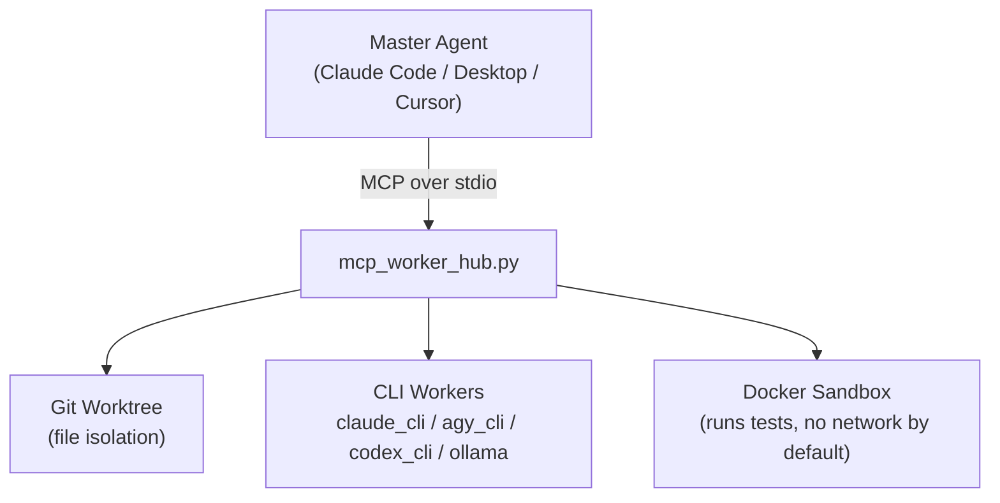

[English README](README.en.md)
# Multi-Agent Hub




用 **MCP (Model Context Protocol)** 打造的可抽換多智能體派工中心。

Master Agent 負責**拆解任務、平行派工、驗證結果**；實際寫程式交給多個 CLI Worker，
每個 Worker 在**自己的 git worktree** 裡工作，測試過了才准合併回主線。

主控端可以是 Claude Code、Claude Desktop 或 Codex / Cursor；
Worker 支援 Claude Code、Antigravity (`agy`)、Codex、Ollama —— 機器上裝了哪個就開哪個，
啟動時自動偵測，沒裝的自動停用。

## 為什麼要 worktree

平行派工最大的坑是多個 agent 同時改同一份檔案。這裡每個子任務拿一個**獨立 worktree ＋ 獨立分支**，
實體隔離，最後用 `git merge --no-ff` 收斂。發生衝突就 `merge --abort` 並回報是哪兩個子任務撞了，
不讓 agent 自己亂解。

## 架構

```
        Master Agent (Claude Code / Desktop / Cursor)
                        │ MCP over stdio
                        ▼
              mcp_worker_hub.py  ←── HUB_WORKERS / HUB_BIN_* / HUB_WAIT_SLICE
                        │
       ┌────────────────┼────────────────┐
       ▼                ▼                ▼
  Git Worktree     CLI Workers      Docker Sandbox
  （檔案隔離）      claude_cli        （跑測試，
  + .hub_prompt     agy_cli           預設無網路）
                    codex_cli
                    ollama
```

## 快速開始

兩種安裝路徑，選一種。

### (a) 當成 Claude Code plugin（推薦，不必 clone）

repo 自帶 `.claude-plugin/marketplace.json`，本身就是一個單一 plugin 的 marketplace：

```powershell
claude plugin marketplace add zkylek1212-k/multi-agent-hub
```

```powershell
claude plugin install multi-agent-hub@multi-agent-hub
```

（在 Claude Code 對話中則是 `/plugin marketplace add ...` 與 `/plugin install ...`。）

**第三步不能省**：plugin 只帶檔案與 MCP 設定，**不會裝 Python 相依**（`mcp[cli]`）。
少了它 MCP server 起不來，`/mcp` 就看不到 `agent-hub`。裝完跑這行：

```powershell
powershell -ExecutionPolicy Bypass -File (Get-ChildItem "$env:USERPROFILE\.claude\plugins\cache\multi-agent-hub\multi-agent-hub\*\install.ps1" | Sort-Object FullName -Descending | Select-Object -First 1).FullName -DepsOnly
```

`-DepsOnly` 只做「裝相依 + 偵測 Worker + 自我測試」，不會在 plugin 目錄裡 `git init`、
也不會另外註冊一份 local scope 的 agent-hub（那會變成重複載入）。跑完重開 Claude Code。

判斷成功：`/mcp` 看到 `agent-hub` 是 connected，且 skill 清單裡有 `multi-agent-dispatch`。

> ⚠️ **plugin 路徑目前只支援 Windows** —— `.mcp.json` 用 `py -3`（Windows Python launcher）啟動。
> macOS / Linux 請走下面的 (b)，並照 [INSTALL.md §3](INSTALL.md) 手動寫 `.mcp.json`。

### (b) clone 後直接跑腳本

Windows，clone 完一行：

```powershell
powershell -ExecutionPolicy Bypass -File .\install.ps1
```

腳本會偵測工具、裝相依、產生 `.mcp.json`（偵測到 plugin 版的就保留不覆寫），最後跑一次自我測試。
偵測不到 `docker` 時，它會用 winget **嘗試自動安裝 Docker Desktop**（會跳 UAC）；
Python、git、Worker CLI 則只偵測不安裝。

需要先裝什麼、macOS / Linux 做法、常見問題，都在 **[INSTALL.md](INSTALL.md)**。

## MCP server 與 Skill

本專案同時提供兩樣東西，缺一不可：

| | 提供什麼 | 檔案 |
| --- | --- | --- |
| **MCP server**（`agent-hub`） | **能力**：派工、worktree、沙盒測試等 7 個工具 | `mcp_worker_hub.py` ＋ `.mcp.json` |
| **Skill**（`multi-agent-dispatch`） | **指示**：派工 SOP —— 怎麼拆、怎麼平行派、怎麼驗證收斂 | `skills/multi-agent-dispatch/SKILL.md` |

**MCP 給能力、Skill 給指示。** 只有 MCP，Master 拿得到工具卻不知道正確流程
（很容易做完一個才派下一個、或跳過測試就宣稱完成）；只有 Skill，那就只是一份做不到的文件。

Skill 隨 plugin 一起安裝，使用者提到平行派工／多 worker 分工時自動觸發；
走路徑 (b) 的話，`install.ps1` 會從 `skills/multi-agent-dispatch/SKILL.md` 生成 `CLAUDE.md`（菜單同源，不會分裂）。

## 工具

| 工具 | 用途 |
| --- | --- |
| `get_active_workers` | 回報本次啟用的 Worker 與實際解析到的執行檔 |
| `git` | worktree add / remove、diff、log、merge |
| `delegate_to_worker` | 非同步派工，立即回傳 job_id |
| `wait_for_job` | 一次等一整批 job（等待長度可設定，避開 client 的逾時上限） |
| `check_job_status` | 非阻塞查詢單一 job |
| `list_jobs` | 所有 job 的狀態表：job_id／Worker／狀態／耗時／任務 |
| `run_in_sandbox` | 在容器中對 worktree 跑測試（網路預設關閉） |

## ⚠️ 安全模型

隔離是**分層而且不完整**的，用之前請認知：

| 階段 | 隔離程度 |
| --- | --- |
| Worker 寫程式 | **無權限隔離**。Worker 帶著 `--dangerously-skip-permissions` 直接跑在你的機器上。worktree 隔離的是「檔案版本」，不是「能做什麼」 |
| 跑測試 | 有隔離。Docker 容器 ＋ 預設無網路 ＋ 記憶體／CPU 上限 |
| Master 讀 Worker 輸出 | **無隔離**。Worker 的 stdout 會進入 Master 的 context |

**Docker 沙盒保護的是「測試」，不是「寫程式」。只在你信任的專案上使用。**

## 文件

| 檔案 | 內容 |
| --- | --- |
| [INSTALL.md](INSTALL.md) | 安裝與部署、工具清單、常見問題 |
| [ARCHITECTURE.md](ARCHITECTURE.md) | 架構原理、設計決策、實測驗證紀錄 |
| [skills/multi-agent-dispatch/SKILL.md](skills/multi-agent-dispatch/SKILL.md) | 派工 SOP 與模型菜單的**唯一真實來源**：隨 plugin 安裝、按需觸發；repo 模式下 `install.ps1` 也從它生成 `CLAUDE.md` |

## License

[MIT](LICENSE)
